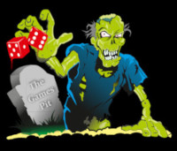

# The Games Pit

The Games Pit is a local gaming shop in Wakefield, West Yorkshire. The shop provides a free gaming area for people to use and sells a variety of merchandise in the gaming field such as Warhammer, Pokemon, Dungeons and Dragons and board games. 

## Table of Contents

1. UX
    * Project Goals
    * User Stories
        * Users
        * Admin
        * Developer
    * Design Choices
    * Wireframes

2. Features 
    * Existing Features
    * Features to be Implemented

3. Database Details
    * Data Storage

4. Technology Used
    * Languages
    * Frameworks
    * Libraries
    * Tools

5. Testing

6. Deployment

7. Credits
    * Content
    * Media
    * Code
    * Acknowledgements

## **UX**
----------------

### *Project Goals*

* Provide potential visitors with an idea of what The Games Pit sells
* Allow potential customers to purchase items directly from the website and have them posted
* Give potential gamers an idea of events that are run and when
* Give access to the social media The Games Pit uses
* Give potential customers the opportunity to create an account where they can store previous orders and their address details
* All potential customers to leave their basket un-purchased and still be there when they return.

### *User Stories*

#### Users

- As a user, I want to view what items I can purchase in one place.
- As a user, I want to be able to make purchases.
- As a user, I want to know my all my details are kept safely and securely.
- As a user, I want to be able to contact the shop.
- As a user, I want to see what events are held in the shop.
- As a user, I want to be able to access social media pages.
- As a user, I want to be able to checkout quickly and easily with or without an account. 

#### Admin

- As site admin, I want to be able to add, edit and delete products easily.
- As site admin, I want to be able to view orders easily.
- As site admin, I want to have the option to show sale and out of stock items.

#### Developer

- As a developer, I want to ensure there is defensive design
- As a developer, I want to ensure only the right people can access the right information.
- As a developer, I want to make the site easy to use for customers and admin.

### *Design Choices*

#### Font

The logo for The Games Pit has always had an old-fashioned look which the shop owner wished to keep. As such, I have used [Uncial Antiqua](https://fonts.google.com/specimen/Uncial+Antiqua?query=uncial).

#### Colours

The shop owner wanted the colours to be related to the zombie logo. The initial colour choice worked around the green of the zombie however, this was soon realised to not be very attractive and we changed it to blue. The colours are directly picked from the zombie's t-shirt. The inital blue was too dark to read against the dark background so this was changed to a paler blue which received better feedback. 

### *Wireframes*

## **Features**
----------------

### *Existing Features*

#### Shop & Shop Front

There is a shop front which matches the style of other online gaming shops with banners on the home page which link to all products in their respective category. Each page provides access to the user's bag, their profile, a search bar and an easily navigable nav-bar.

Users can navitage the site and easily choose the products they want to purchase.

#### Shopping Bag

Users can see their shopping bag pop up when they add an item to is but can also access it easily by clicking the link. The bag provides a quick overview of what is there and allows users to easily update or delete items in it.

#### Profile 

Users can easily access their profile from any page where they can update and store their delivery details for ease of checkout for future purchases.

### *Features to be Implemented*

## **Database Details**
----------------

### *Data Storage*

## **Technology Used**
----------------
### *Languages*

- HTML
- CSS
- Javascript
- Python

### *Frameworks*

- Django
- Bootstrap

### *Libraries*
Jquery
Stripe Payments

### *Tools*
AWS
Heroku
Git
Postgres

## **Testing**
----------------

## **Deploment**
----------------

## **Credits**
----------------

###  *Content*

The content of the website was made possible by The Games Pit.

### *Media*

Where possible, images have been provided by The Games Pit.
Other images provided by: 
- [Photo by Anete Lusina](https://www.pexels.com/photo/selective-focus-of-dice-on-monopoly-board-game-4792367/) 
- [Photo by Nika Benedictova](https://www.pexels.com/photo/black-dice-in-tilt-shift-lens-7025165/)

### *Code*

Where external code has been used, this has been acknowledged in the areas this has happened.

### *Acknowledgements*

- Richard Wells - A fabulous mentor who provided guidance and support as well as listening to my complaining and stupid moments

- Michael Lamb & the staff and volunteers at The Games Pit- For providing information about the shop products
 