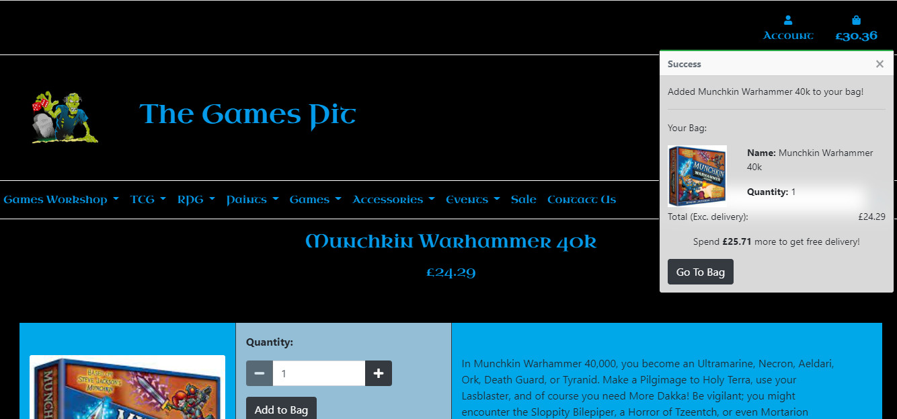
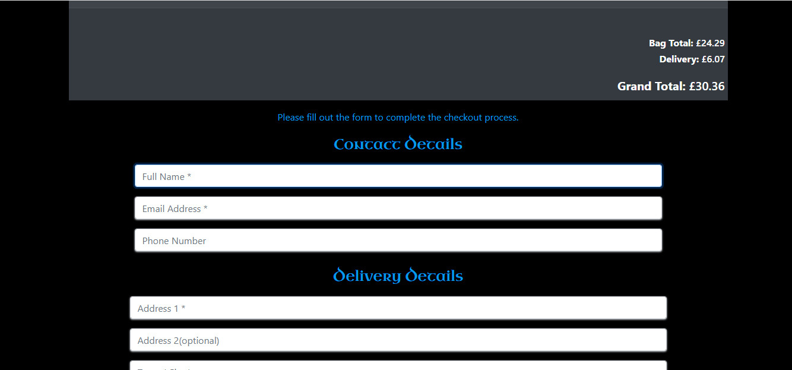
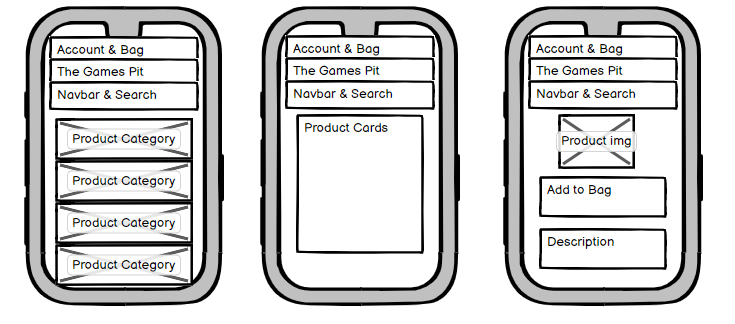
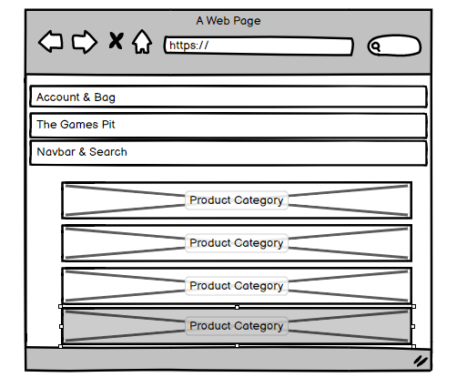

# The Games Pit

The Games Pit is a local gaming shop in Wakefield, West Yorkshire. The shop provides a free gaming area for people to use and sells a variety of merchandise in the gaming field such as Warhammer, Pokemon, Dungeons and Dragons and board games. 

## Table of Contents

1. UX
    * Project Goals
    * User Stories
        * Users
        * Admin
        * Developer
    * Design Choices
    * Wireframes

2. Features 
    * Existing Features
    * Features to be Implemented

3. Database Details
    * Data Storage

4. Technology Used
    * Languages
    * Frameworks
    * Libraries
    * Tools

5. Testing
    * Bugs

6. Deployment

7. Credits
    * Content
    * Media
    * Code
    * Acknowledgements

## **UX**
----------------

### *Project Goals*

* Provide potential visitors with an idea of what The Games Pit sells
* Allow potential customers to purchase items directly from the website and have them posted
* Give potential gamers an idea of events that are run and when
* Give access to the social media The Games Pit uses and an ability to contact them via the website
* Give potential customers the opportunity to create an account where they can store previous orders and their address details
* All potential customers to leave their basket un-purchased and still be there when they return.

### *User Stories*

#### Users

- As a user, I want to view what items I can purchase in one place.

- As a user, I want to see individual product details.

- As a user, I want to see sale items easily.

- As a user, I want to be able to make purchases and view my total easily.

- As a user, I want to know my all my details are kept safely and securely.
- As a user, I want to be able to contact the shop.

- As a user, I want to see what events are held in the shop.

- as a user, I want to be able to create an account.

- As a user, I want to be able to checkout quickly and easily with or without an account. 

- As a user, I want a personalised profile.

- As a user, I want to be able to search for items.

- As a user, I want to be able to sort items.

- As a user, I want to be able to adjust an order from my bag.

#### Admin

- As site admin, I want to be able to add, edit and delete products easily.

- As site admin, I want to be able to view orders easily.

- As site admin, I want to have the option to show sale and out of stock items. (shown in other screenshots)

#### Developer

- As a developer, I want to ensure only the correct accounts can access areas.

- As a developer, I want to make the site easy to use for customers and admin. (seen in other screenshots)

### *Design Choices*

#### Font

The logo for The Games Pit has always had an old-fashioned look which the shop owner wished to keep. As such, I have used [Uncial Antiqua](https://fonts.google.com/specimen/Uncial+Antiqua?query=uncial).

#### Colours

The shop owner wanted the colours to be related to the zombie logo. The initial colour choice worked around the green of the zombie however, this was soon realised to not be very attractive and we changed it to blue. The colours are directly picked from the zombie's t-shirt. The inital blue was too dark to read against the dark background so this was changed to a paler blue which received better feedback. 

The colours passed the accessibility checker:

### *Wireframes*

*Extra Small and Small Screens*

For small and extra small screens, I wanted the pages to be stacked down rather than across so there is plenty of space for the description in items.

*Medium and Above*

For medium and larger screens, the product information page is planned to go across to suit the wider screen sizes.

Home Page (same as on mobile)

Products Page

Individal Products

Forms

All forms will have the same layouy

## **Features**
----------------

### *Existing Features*

#### Shop & Shop Front

There is a shop front which matches the style of other online gaming shops with banners on the home page which link to all products in their respective category. Each page provides access to the user's bag, their profile, a search bar and an easily navigable nav-bar.

Users can navitage the site and easily choose the products they want to purchase.

#### Shopping Bag

Users can see their shopping bag pop up when they add an item to is but can also access it easily by clicking the link. The bag provides a quick overview of what is there and allows users to easily update or delete items in it.

#### Profile 

Users can easily access their profile from any page where they can update and store their delivery details for ease of checkout for future purchases.

### *Features to be Implemented*

For the contact app, in the view under if request.method =='POST' add (the 'from' part of the code is from [here]))

    name = request.POST.get('name')
    email = request.POST.get('email')
    message = request.POST.get('message')

    data = {
        'name': name, 
        'email': email,
        'message': message,
    }

    message = '''
    New message: {}

    From: {}
    '''.format(data['message'], data['email'])
    send_mail(message, '', [your email address])

At the top, import django.core.mail import send_mail

The site would benefit from a quick add to cart button.

## **Database Details**
----------------

### *Data Storage*

Key:

N = Null

B = Blank

FK = Foreign Key

#### UserProfile

| Name                      | Data Type | Form Validation | Max Characters |
| ------------------------- | --------- | --------------- | -------------- |
| user                      | onetoone  | N/B = True      |                |
| default_phone             | charfield | N/B = True      | 12             |
| default_address_line_1    | charfield | N/B = True      | 80             |
| default_address_line_2    | charfield | N/B = True      | 80             |
| default_town_city         | charfield | N/B = True      | 80             |
| default_county            | charfield | N/B = True      | 80             |
| default_post_code         | charfield | N/B = True      | 8              |
| default_country           | charfield | N/B = True      | 80             |

#### Events

| Name           | Data Type | Form Validation | Max Characters |
| ---------------| --------- | --------------- | -------------- |
| user           | charfield | N/B = False     | 254            |
| description    | textfield | N/B = False     | -              |
| date           | datefield | N/B = True      | -              |
| time           | timefield | N/B = True      | -              |
| image_url      | urlfield  | N/B = True      | -              |
| image          | imagefield| N/B = True      | -              |

#### Products

Category

| Name           | Data Type | Form Validation | Max Characters |
| ---------------| --------- | --------------- | -------------- |
| main_cat       | charfield | N/B = False     | 254            |
| friendly_name  | textfield | N/B = True      | 254            |

SubCat

| Name           | Data Type | Form Validation | Max Characters |
| ---------------| --------- | --------------- | -------------- |
| main_cat       | FK        | N/B = True      | 254            |
| sub_cat        | charfield | N/B = False     | 254            |

Product

| Name           | Data Type | Form Validation     | Max Characters |
| -------------- | --------- | ------------------- | -------------- |
| category       | FK        |                     |                |
| sub_cat        | FK        |                     |                |
| extra_cat      | charfield | N/B = True          | 254            |
| name           | charfield | N/B = True          | 254            |
| description    | textfield |                     |                |
| in_stock       | Boolean   | default= True       | -              |
| price          | decimal   | N/B = False         | 6              |
| on_offer       | Boolean   | default = False     | -              |
| offer_price    | decimal   | N/B = True          | 6              |
| image_url      | urlfield  | N/B = False         | 1024           |
| image          | imagefield| N/B = false         | 8              |
| created        | datetime  | auto_now_add = True | -              |

#### Orders

Order

| Name                      | Data Type | Form Validation               | Max Characters |
| ------------------------- | --------- | ----------------------------- | -------------- |
| order_number              | charfield | N/B = False                   | 32             |
| user_profile              | FK        | N/B = True                    | -              |
| full_name                 | charfield | N/B = False                   | 60             |
| email                     | emailfield| N/B = False                   | 354            |
| phone                     | charfield | N/B = True                    | 12             |
| address_line_1            | charfield | N/B = False                   | 254            |
| address_line_2            | charfield | N/B = True                    | 254            |
| town_city                 | charfield | N/B = False                   | 80             |
| county                    | charfield | N/B = False                   | 80             |
| post_code                 | charfield | N/B = False                   | 8              |
| country                   | charfield | N/B = False default = GB      | 30             |
| date                      | datetime  | auto_add_now = True           | -              |
| sub_total                 | decimal   | N/B - False default = 0       | 6              |
| delivery_cost             | decimal   | N/B - False default = 0       | 6              |
| grand_total               | decimal   | N/B - False default = 0       | 6              |
| original_bag              | textfield | N/B - False                   | -              |
| stripe_piid               | charfield | N/B - False                   | 254            |

OrderLineItem

| Name            | Data Type | Form Validation              | Max Characters |
| --------------- | --------- | ---------------------------- | -------------- |
| order           | FK        |                              |                |
| product         | FK        |                              |                |
| quantity        | integer   | default = 0                  | -              |
| line_item_total | decimal   | N/B = False editable = False | -              |

## **Technology Used**
----------------
### *Languages*

- HTML
- CSS
- Javascript
- Python

### *Frameworks*

- Django
- Bootstrap

### *Libraries*
Jquery
Stripe Payments

### *Tools*
[AWS](https://aws.amazon.com/)
[Heroku](https://www.heroku.com/)
Postgres
[Git](https://github.com/)
[WebAim](https://webaim.org/resources/contrastchecker/)
[FontAwesome](https://fontawesome.com/)
[Bootstrap](https://getbootstrap.com/)
[GIMPSoftware](https://www.gimp.org/)
[GoogleFonts](https://fonts.google.com/)
[W3CCSSValidator](https://jigsaw.w3.org/css-validator/)

## **Testing**
----------------

No automated testing has taken place in this project; it has all been manual and via User Experience.

*Tool Tests*

CSS

My CSS passed through the validator

JS

MY JS passed through the JSHint validator. I had missed a few semi-colons so I added those.

Speed Test

HTML

--------------

**Expected Outcome**: All products in the database will load in both the correct category and correct sub category. Each product will be clickable and will lead to the product information page; if a product is out of stock there will be a badge saying so, if an item is on offer, two prices will be displayed with the original price struck out and the offer price showing. Out of stock items will be clickable however, there will be no purchasing options.

**Testing Carried out**: After adding products to the database, ensuring some were out of stock and some were on offer, I loaded up the webpage and navigated to various areas to check the items were visible where they should be. I checked that out of stock items weren't purchasable adn that badges and offer prices all showed.

**Result**: PASS: All items display correctly, out of stock items were not purchasable and had a badge stating they were out of stock and items on offer showed the correct pricing.

------------

**Expected Outcome** : customers can make a purchase whether they are logged in or not.

**Testing Carried out**: I ran through the checkout process both as a registered user and as a non-registered user to ensure my purchases completed.

**Result**: PASS: I could make a purchase as both a registered user and when not signed in.

------------
**Expected Outcome** : registered, logged-in users should be able to see previous orders and store a delivery address on their profile page.

**Testing Carried out**: Whilst I was logged in, I saved an address on my profile. After doing so, I made a couple of purchases. 

**Result**: PASS: When making purchases, my address was automatically filled in. After making each purchase, I returned to my profile page and could see each of my previous orders.

------------
**Expected Outcome** : all links will work and display the correct items

**Testing Carried out**: I manually clicked through each link; I had not added the links to the different paints so they did not work. 

**Result**: PASS: After adding the links to the paints, all links worked and displayed the correct items.

------------
**Expected Outcome** : if there are no products in a category / sub-category, a message will be displayed which says so.

**Testing Carried out**:  I navigated to the paints page as I knew there were no items in there.

**Result**: PASS: Message was correctly displayed on the pages it needed to be.

------------
**Expected Outcome** : Website will display well across a variety of device sizes.

**Testing Carried out**: I tested the website on small, medium and large screens.

**Result**: FAIL: The website worked well on medium and large devices however, on mobile, there were some errors that were visible; the top navbar didn't display as well as I would like and therefore some code tweaks are required.

------------
**Expected Outcome** : webhooks will work on Stripe.

**Testing Carried out**: I made several purcahses on the live site.

**Result**: PASS: Webhooks worked.

------------
**Expected Outcome** : when logged in as a superuser, I can add, edit and delete items and, if I'm not a superuser, I can't.

**Testing Carried out**: I logged in as both a non superuser a superuser and visited various pages and items.

**Result**: PASS: All items were editable and deletable by the superuser account and were not by a normal account.

------------

### Bugs

**Problem**: live site wouldn't load

**Caused by**: having the incorrect secret keys in Heroku

**Resolved by**: putting the correct secret keys

------------
**Problem**: database wouldn't load on deployed site as it was blank.

**Caused by**: for some reason, the database had migrated (all checked when showmigrations was run) and it said loaddata had worked but it hadn't.

**Resolved by**: deleted all associated migrations and files and started again.

------------
**Problem**: when I tried to loaddata, it said there was conflicting information in the database so data couldn't be loaded.

**Caused by**: two users had the same email address.

**Resolved by**: deleted one of the users.

------------
**Problem**: images on the live site, when running through AWS, wouldn't load

**Caused by**: Unknown; the images all uploaded to AWS but they wouldn't load on the site.

**Resolved by**: editing the products and re-uploading the images.

------------
**Problem**: when an item was deleted from the bag, the toast disrupted the whole layout of the website. The page jumped and compressed into 8 columns instead of the whole screen and the success toast took the last 4 columns.

**Caused by**: the toast over-riding the page layout.

**Resolved by**: re-wrote the code.

------------
**Problem**: one user, when trialling the site, got a 404 error when pressing on the basket when it was empty. After investigation, it was the home button on the empty bag page which wasn't working.

**Caused by**: Forgot the closing ".

**Resolved by**: Closing the "".

------------

## **Deployment**
----------------
The site has been deployed and can be found [here](https://the-games-pit.herokuapp.com/).

### *How to Deploy via Git*

Run the following commands in the terminal:

    - git clone https://github.com/HollyT85/the-games-pit

    - cd the-games-pit

    - pip install -r requirements.txt

Once the above has successfully been achieved:

    - create an env.py in the root directory and set up your environment variables

    import os

    os.environ["SECRET_KEY"] = "[Your Secret Key]"
    os.environ["STRIPE_PUBLIC_KEY"] = "[Your Stripe Key]"
    os.environ["STRIPE_SECRET_KEY"] = "[Your Stripe Secret Key]"
    os.environ["DATABASE_URL"] = "[Your DB URL]

### Setting up your database

1. Run the command:

    * python3 manage.py migrate

2. Back up current database with the following command:

    * ./manage.py dumpdata --exclude auth.permission --exclude contenttypes > db.json

3. Load the data:

    * ./manage.py loaddata db.json

4. Create a superuser:

    * python3 manage.py createsuperuser

### Deploying to Heroku

1. Create or login to your account on [Heroku](https://heroku.com/).

2. Create a new app; to save confusion, it may be best to call the app the same as the repository

3. In the resources tab, choose the addon Heroku Postgres (free).

4. In the settings, click 'Reveal Config Vars'. Copy the DATABASE_URL into settings.py on your repository.

5. Add the following config vars (your final config vars should look like this):

| Key                   | Value              |
|---------------------- | ------------------ | 
| AWS_ACCESS_KEY_ID     | your value         |
| AWS_SECRET_ACCESS_KEY | your value         |
| DATABASE_URL          | provided by Heroku |
| SECRET_KEY            | your value         |
| STRIPE_PUBLIC_KEY     | your value         |
| STRIPE_SECRET_KEY     | your value         |
| STRIPE_WH_SECRET      | your value         |
| USE_AWS               | True               |

6. Follow the set-up data base instructions above to populate the database to the cloud storage

7. Return to Heroku and, on the dashboard, click deploy.

8. Connect Heroku to your Github repository and select automatic deployment from the main/master branch.

9. Once your app has been deployed, select open app at the top right.

## **Credits**
----------------

###  *Content*

The content of the website was made possible by The Games Pit.

### *Media*

Where possible, images have been provided by The Games Pit.
Other images provided by: 
- [Photo by Anete Lusina](https://www.pexels.com/photo/selective-focus-of-dice-on-monopoly-board-game-4792367/) 
- [Photo by Nika Benedictova](https://www.pexels.com/photo/black-dice-in-tilt-shift-lens-7025165/)

### *Code*

Where external code has been used, this has been acknowledged in the areas this has happened.

### *Acknowledgements*

- Richard Wells - A fabulous mentor who provided guidance and support as well as listening to my complaining and stupid moments

- Michael Lamb & the staff and volunteers at The Games Pit- For providing information about the shop products
 